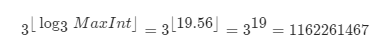

# [326. 3 的幂](https://leetcode.cn/problems/power-of-three/)

## 方法一、常规循环

### 思路

常规循环法，遍历判断 3**i 是否等于 n，等于则证明 n 是 3 的幂次方。

### 复杂度

时间复杂度：O(logN)

空间复杂度：O(1)

### 代码

```php
class Solution {

    /**
     * @param Integer $n
     * @return Boolean
     */
    function isPowerOfThree($n) {
        if($n == 1) return true;

        for($i = 1; 3 ** $i <= $n; $i++) {
            if(3 ** $i == $n ) return true;
        }

        return false;
    }
}
```

## 方法二、整数限制

### 思路

进阶法，不用循环递归，时间复杂度降低为 O(1)

32 位机中整型占4个字长，最大值为 2147483647 （2^31 - 1）。

3的幂次方的最大整数值为 1162261467。计算如下：



若 n 为3的幂次方，则 1162261467 除以 n 一定没有余数，即 1162261467 取模 n 结果一定为 0。否则，n则不是3 的幂次方。

### 复杂度

时间复杂度：O(1)

空间复杂度：O(1)

### 代码

```php
class Solution {

    /**
     * @param Integer $n
     * @return Boolean
     */
    function isPowerOfThree($n) {
        return $n > 0 && 1162261467 % $n == 0;
    }
}
```